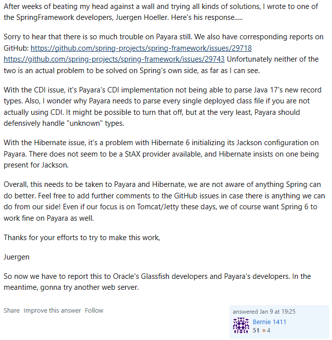
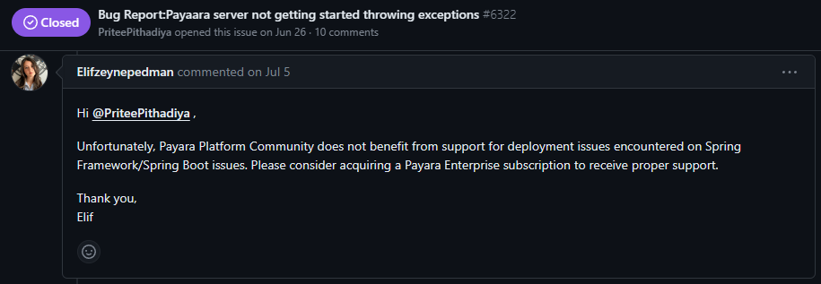

# The situation with Spring

1) Newest Spring version needs Java17+
2) Dependency Injection from Jakarta cannot scan every class found in the spring project and will throw an error
3) Java 11 is required if Spring is to be used on Payara
4) Java 11 will not work with the other microservices
5) RIP Spring :(

