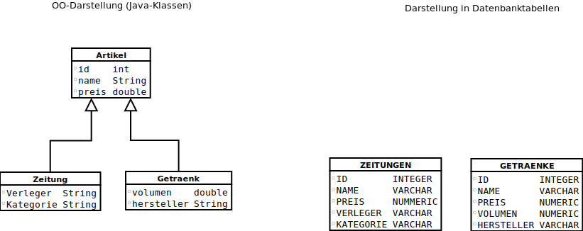
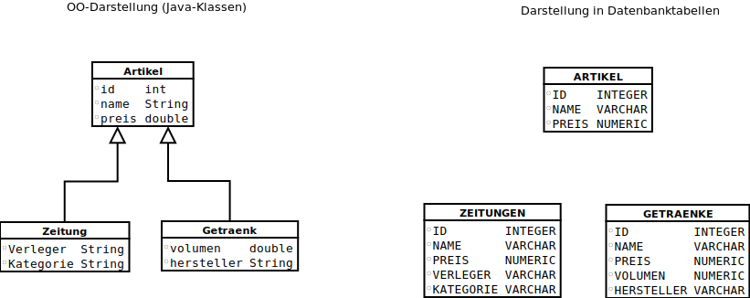
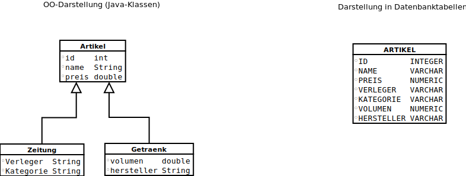
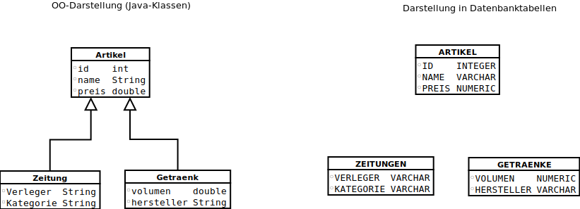

# Theoretische Grundlagen

## REST-Schnittstelle

Bei REST (Representational State Transfer) handelt es sich um ein
Programmierparadigma für verteile Systeme, insbesondere für Webservices. Es
dient schwerpunktmäßig der Maschine-zu-Maschine-Kommunikation und beinhaltet
fünf Grundprinzipien.

### Grundprinzipien von REST

**Zustandslose Client/Server-Kommunikation:** Die Kommunikation zwischen Client
und Server erfolgt bei REST zustandslos. Das heißt in jeder REST-Nachricht
müssen alle Informationen, die für den Server/Client wichtig sind, enthalten
sein. Diese Zustandslosigkeit begünstigt eine Skalierbarkeit, da Anfragen an
beliebige Maschinen verteilt werden können.

**Identifizierbare Ressourcen:** In REST besitzt jede Ressource zur
Identifikation einen eindeutigen Schlüssel. Diese werden als URIs (Uniform
Resource Identifier) bezeichnet und sind global eindeutig.

Hier zwei Beispiele:

```http
http://example.com/cars/42
http://fh-bielefeld.de/ServerSideJobsBackend/serversidejobs/jobs
```

Im oberen Beispiel kann man davon ausgehen, dass die URI genau eine Entität
identifiziert, und zwar ein Auto mit der ID 42.  Das zweite Beispiel
identifiziert eine Ressource für alle Jobs, die aktuell auf dem Backend von
ServerSideJobs bekannt sind.

**Hypermedia:** Bei Hypermedia handelt es sich um das Konzept der Verknüpfung.
Dabei können mithilfe von URIs Ressourcen global verknüpft werden.  Ein
Beispiel:

```xml
<?xml version="1.0" encoding="UTF-8"?>
<breakfast_menu>
<food name='Belgian Waffles' link='/food/7' />
<food name='Strawberry Belgian Waffles' link='/food/8' />
<food name='French Toast' link='/food/12' />
...
</breakfast_menu>
```

Der Client fordert eine Liste von Speisen an und bekommt vom Server diese Liste
zurück und jeweils einen Link, über den er sich alle Details zu diesem Element
ansehen kann.

Dadurch kann auch eine Navigation in einer Applikation realisiert werden, indem
der Server mitteilt, in welche Zustand der Client aus seinem aktuellen Zustand
wechseln kann.

**Ressourcen-Repräsentation:** Der Server hält verschiedene Repräsentationen
von Ressourcen bereit. Der Client kann dann mittels  HTTP Content Negotiation
Anforderungen beim Aufruf stellen. Zum Beispiel kann er ein bestimmtes
Datenformat (XML, JSON ...) anfordern. Dabei teilt er dem Server im
Accept-Header mit welche Medienformate (MIME-Types) er erwartet. Dabei kann der
Client mehrere Formate angeben. Diese kann er dann zusätzlich auch noch mit
einer Präferenz bewerten und dem Server zum Beispiel mitteilen, dass er am
liebsten XML hätte und falls der Server das nicht unterstützt auch JSON
akzeptiert.

**Uniforme Schnittstelle:** REST verwendet eine Reihe von HTTP Standardmethoden
als Schnittstelle zu Ressourcen. Zum Beispiel GET, POST, PUT usw.

### REST und HTTP-Operationen

Unter REST werden einige HTTP Standard Methoden implementiert die wichtigsten
sind dabei GET, PUT, POST, DELETE

**GET:** Mit GET können Informationen einer Ressource abgefragt werden. Dabei
handelt es sich um eine "sichere" Methode. Das heißt, es findet ein nur
lesender Zugriff statt und der Client muss nicht mit Seiteneffekten seines
Aufrufs rechen.

Ebenfalls kann ein bedingtes GET genutzt werden, dabei werden dem Server direkt
Bedingungen mitgeteilt unter denen er eine vollständig Antwort schicken soll.

Dafür gibt es zum Beispiel das If-Modified-Since-Headerfeld. Wenn die Ressource
in dem genannten Zeitraum nicht verändert wurden, dann schickt der Server die
Meldung 304 "Not Modified" zurück. Durch die Angabe solcher Bedingungen kann
der Datenverkehr optimiert werden, weil Informationen nicht unnötig verschickt
werden müssen.

**PUT:** Mit der Methode PUT können Ressourcen modifiziert werden oder, falls
sie nicht existieren, auch erstellt werden.

**POST:** Mit POST können ebenfalls Ressourcen erstellt werden. Der Unterschied
ist dabei die Angabe der URI. Bei PUT zeigt die URI direkt auf die Ressource
die verändert oder erstellt werden soll. POST fügt eine neue Ressource
unterhalb der angegebenen Ressource hinzu.

Beispiel:

```http
PUT		http://example.com/cars/42
POST	http://example.com/cars
```

Dabei ist zu erwähnen das PUT idempotent ist. Eine Methode wird idempotent
genannt, wenn das Ergebnis des Aufrufs immer gleich ist, egal ob die Methode
einmal aufgerufen wird oder mehrfach.

Bei PUT würde die Ressource beim ersten Aufruf geändert bzw. erstellt werden
und bei darauf folgenden Aufrufen nicht mehr geändert werden, da alle
Informationen gleich geblieben sind.

Bei POST würden immer neue Ressourcen mit den gleichen Informationen erstellt
werden.

**DELETE:** Mit DELETE können Ressourcen gelöscht werden.

## Hibernate

Bei Hibernate handelt es sich um ein ORM-Framework(object-relational
mapping-Framework) für Java.  Es unterstützt die SQL-Dialekte von über 20
Datenbanken darunter MS SQL, PostgreSQL und MySQL.

### Objektrelationale Abbildung

Bei der Objektrelationale Abbildung (englisch object-relational mapping) oder
auch kurz ORM handelt es sich, um eine Technik der Softwareentwicklung um
Objekte aus objektorientierten Programmiersprachen in relationalen Datenbanken
abzuspeichern.

Für das Programm erscheint die Datenbank dann wie eine objektorientierte
Datenbank.

Das Problem dabei ist, das in der objektorientierte Programmierung(OOP) Daten
und Verhalten in Objekten gekapselt wird. Am Beispiel eines Versandhandels.
Jedes Objekt Kunde enthält Attribute für den Namen, die Telefonnummer und eine
Liste von Lieferadressen, dabei beinhaltet die Liste Objekte vom Typ
Lieferadressen in denen wiederum genauere Angaben stehen.

Eine relationale Datenbank ist aber nicht objektorientiert und kann deswegen
nur Variablen in den Tabellen speichern. Dadurch muss der Entwickler die
Objekte in geeignete Werte konvertieren, um Sie in der Datenbank zu speichern,
oder er benutzt nur einfache Variablen. ORMs setzten die zuerst genannte Lösung
um.

### Persistenzkontext

Beim Peristenzkontext handelt es sich um eine Umgebung, in der Entitäten mit
der Datenbank synchronisiert werden. Man kann es sich auch als einen Cache
vorstellen, der die Entitäten zwischenspeichert.

Im Persistenzkontext werden die Eintitätsinstanzen und ihr Lebenszyklus
verwaltet.

### Objekte Verwalten

Objekte können verschiedene Zustände im Persistenzkontext annehmen:

- **transient** Jedes neu erstellte Objekt ist erstmal im Zustand Transient. Es
  ist nicht in der Datenbank vorhanden. Wenn keine Referenz mehr existiert,
  wird das Objekt vom Garbage Collector entfernt.

- **persistent** Das Objekt ist mit einem Persistenzkontext verbunden und wird
  mit der Datenbank synchronisiert.

- **detached** Das Objekt war mit dem Persistenzkontext verbunden und dieser
  wurde geschlossen. Dadurch kann der Zustand nicht mehr mit der Datenbank
  abgeglichen werden und Änderungen werden nicht mehr synchronisiert

- **removed** Das Objekt wurde für das Löschen vorgesehen.

### Vererbung

Der Fall der Vererbung muss im Kontext eines ORM nochmal gesondert betrachtet
werden, da relationale Datenbanken keine Vererbung kennen. Hibernate bietet
dafür 4 Strategien wie Vererbungen auf der Datenbank abgebildet werden können:

- **MappedSuperclass** Bei der MappedSuperclass Strategie bekommt jede
  Subklasse seine eigene Tabelle mit allen eigenen Variablen und den vererbten.
  Die vererbende Klasse wird selber aber nicht in der Datenbank gespeichert.
  Dies ist nützlich, falls man Basisinformationen zu Hibernate übergeben
  möchte, die Klassen aber sonst nichts miteinander zu tun haben. Mit
  MappedSuperclass kann keine Verbindung unter den Subklassen verwaltet werden.
  
  

- **Table-Per-Class** Die Table-Per-Class Strategie ist so ähnlich wie die
  MappedSuperclass Strategie, mit dem Unterschied, dass die vererbende Klasse
  ebenfalls in der Datenbank abgebildet wird und man dadurch auch
  Vererbungsstrukturen darstellen kann. Dadurch kann man auch nach allen
  Subklassen suchen. Dabei ist zu beachten, dass jede Klasse Ihre eigene
  Tabelle bekommt, was den Aufruf einer bestimmten Klasse effizient gestaltet.
  Sobald man aber mehrere unterschiedliche Klassen benötigt wird die Abfrage
  intern sehr komplex, da Hibernate ein JOIN über alle benötigten Tabellen
  durchführt.



- **Single Table** Bei der Single Table Strategie werden alle Variablen von den
  Subklassen in eine Tabelle mit der vererbenden Klasse geschrieben, dadurch
  werden Abfragen über mehrere Klassen sehr effizient. Zu Beachten ist dabei
  aber, dass jede Klasse nur die Felder benutzt, die Sie selber braucht und
  alle anderen auf null setzt. Dadurch kann ein not null constraint nur auf
  Felder benutzt werden, die von allen Subklassen genutzt werden.



- **Joined Table** Die Joined Table Strategie beinhaltet ähnlich wie die
  Table-Per-Class Strategie eine Tabelle pro Klasse, nur das in der Tabelle für
  die Subklasse nur die neuen Variablen vorhanden sind und alle vererbten
  Variablen in der Tabelle der vererbenden Klasse. Falls man ein Objekt
  abfragt, muss dadurch immer eine JOIN Abfrage für beide Tabellen genutzt
  werden.



### Loading

Hibernate bietet zwei Strategien zum Laden von Objekten aus der Datenbank an.
Die erste ist Lazy Loading, dabei wird beim Laden nur ein Platzhalter erstellt
und beim ersten Zugriff auf das Objekt wird das Objekt erst aus der Datenbank
geladen. Andersherum verhält es sich beim Eager Loading, dabei wird das Objekt
direkt aus der Datenbank ausgelesen.

### Abfrageverfahren

Hibernate bietet 3 unterschiedliche Methoden, um Anfragen an eine Datenbank zu
stellen:

- **Query by Criteria** Dabei kann man Kriterien festlegen nach denen gefiltert
  werden sollen.

```java
cr.select(root).where(cb.gt(root.get("itemPrice"), 1000));
```

Gibt alle Objekte aus bei denen der "itemPrice" größer als 1000 ist.

```java
cr.select(root).where(cb.isNotNull(root.get("itemDescription")));
```

Gibt alle Objekte aus bei denen die Zeile "itemDescription" nicht null ist.

- **Hibernate Query Language** Hibernate Query Language oder kurz HQL ist so
  ähnlich wie SQL nur mit dem Unterschied, dass es objektorientiert ist und
  dadurch auch Vererbungen und andere Strukturen von OOP versteht.
- **Natives SQL** Die dritte Möglichkeit ist es natives SQL zu schreiben, dabei
  verliert man aber die Möglichkeit seine Datenbank schnell zu wechseln, da die
  Abfragen dann im jeweiligen SQL Dialekt verfasst werden müssen.

## SWAC

SWAC ist eine UI- sowie eine DataAccess-Bibliothek von Florian Fehring und
beruht auf der Trennung von Code und Design. Es baut auf den Graphischen
Elementen von UIkit auf und bietet unter anderem Komponenten um Daten
auszuwählen, zu bearbeiten und anzuzeigen. Des Weiteren unterstützt SWAC
Komponente für den Upload von Dateien, das Suchen von Daten und zur Darstellung
von Diagrammen. Die Komponenten stellen Anforderungen an die Daten, so muss zum
Beispiel eine ID vorhanden sein. Außerdem werden die Darstellungen der
Komponenten von Templates bestimmt. Die vorgefertigten Templates können
verändert werden oder es können eigene Templates geschrieben werden.
Datenquellen lassen sich in der Konfigurationsdatei anbinden. Für die Benutzung
von SWAC werden Grundkenntnisse in HTML, JavaScript und CSS benötigt. Wodurch
eine schnelle Entwicklung von Webanwendungen gewährleistet wird.
