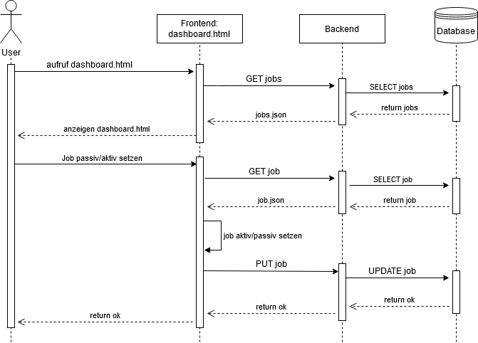

# Konzeptionelle Arbeiten

## Use-Cases

Wir haben bei den Use-Cases zwei Benutzergruppen identifiziert, die mit unserem
Programm interagieren. Einmal haben wir den Nutzer, der die Jobs administriert.
Zusätzlich gibt es noch die Gruppe der Entwickler, die unser Programm durch
zusätzliche Jobs erweitern sollen.  Es folgen einige Use-Cases der beiden
Benutzergruppen:

> Als **Nutzer** möchte ich **Jobs beenden können**, um **schneller auf Fehler
> zu reagieren**.

Falls der Nutzer bei den Einstellungen des Jobs einen Fehler gemacht hat, oder
vergessen hat einen weiteren Job zu verketten, dann möchte er den Job vorzeitig
beenden. Es geht dabei hauptsächlich um die Jobs, die länger Laufen z. B. den
Download von einer REST-Schnittstelle. Bei kürzeren Jobs ist die Reaktionszeit
des Nutzers, meist zu hoch um den Job manuell abzubrechen.

> Als **Entwickler** möchte ich **neue Jobs hinzufügen können ohne mir vorher
> den gesamten Code anzusehen**, damit ich **schneller Jobs programmieren
> kann**.

Ein Entwickler möchte sich nicht erst das komplette Programm angucken um es
erweitern zu können. Das würde eine hohe Arbeitsaufwand bedeuten und dadurch
hohe Kosten. Stattdessen will der Entwickler am liebsten eine Vorlage haben mit
der er einfach Anfangen kann die eigentlichen Funktionalitäten zu
programmieren.

> Als **Nutzer** möchte ich **automatisch eine Email bekommen wenn ein
> bestimmter Job fehl schlägt**, damit ich **darauf reagieren kann**.

Um zeitnah auf Fehler zu reagieren soll ein beim Fehlschlagen eines Jobs
automatisch eine E-mail an den zuständigen Nutzer verschickt werden, damit
dieser den Vorgang überprüfen kann und Korrekturen durchführt.

## Software-Architektur

### UML-Diagramme

UML-Digramm des Job-Paketes:

Die wichtigsten Klassen sind hier `Job`, `JobController` und `JobRunner`. `Job`
ist die Super-Klasse aller Jobs und wird später näher beschrieben.

Der `JobController` ist für das schedulen von Jobs zuständig und hat dazu eine
Liste aller Jobs. Wenn ein Job hinzugefügt wird (mit `addJob()`), wird dieser
automatisch gescheduled (sofern er aktiv ist).  Jobs können auch zum einmaligen
Laufen (ggf. mit Verzögerung) gescheduled werden. Die geschedulten Jobs werden
dann von einem `JobRunner` ausgeführt (welcher von Thread erbt, jeder
`JobRunner` läuft also in einem eigenem Thread.

Mit `IntervalHelpers` lässt sich überprüfen, ob ein Intervall dem geforderten
Format entspricht. Vor allem enthält die Klasse eine Methode, um aus einem
Intervall den nächsten Zeitpunkt zu errechnen, an dem der Job ausgeführt werden
soll.

`JobResult` stellt das Ergebnis von der Ausführung eines Jobs dar.  Daraus kann
ein Log-Eintrag generiert werden und daraus können die Parameter für den
nächsten Job entnommen werden.

`JobParameter` stellt einen Job-Parameter dar, welche aus einem Typen, einem
Namen und einem Wert bestehen. Der Typ muss aus dem Enum `ParameterType` sein.

Mit `JobParameterInfo` gibt ein Job über einen Parameter auskunft, den es
unterstützt. Dafür wird der Name des Parameters, der Typ sowie eine
Beschreibung angegeben. Mit den check- bzw. hint-Methoden können
Benutzereingaben überprüft werden und Hinweise gegeben werden, was zwar
momentan nicht genutzt wird, aber eine einfache Erweiterung um diese
Funktionalität erlaubt.

Zudem enthält das Paket die Klasse `Person` (die eine Person darstellt) sowie
`JobStruct`, mit der sichergestellt wird, dass eine Job-Instanz nur einmal
gleichzeitig läuft.

Das UML-Diagramm der Klassen für die REST-Schnittstelle:

Die Klasse `Jobs` enthält die Schnittstelle zum Auflisten sowie zum Erstellen
und Bearbeiten von Jobs. Mit `Logs` können Logs ausgegeben werden. Mit
`Persons` können Personen aufgelistet und erstellt werden.

Zudem können Jobs manuell gestartet werden mit `StartJob` und abgebrochen
werden mit `AbortJob`.

Daneben gibt es noch die Klassen `ApplicationConfig` und `CorsFilter`.
`ApplicationConfig` ist notwendig, damit JAX-RS weiss, welche Klassen es
benutzen soll. Diese Klasse enthält noch den String `BASEURL`, mit dem die
Basis-URL des Servers auf dem die REST-Schnittstelle läuft eingestellt werden
kann. Mit Hilfe von `CorsFilter` werden die CORS-Header angepasst.

### UML-Diagramm Frontend

Unser Frontend ist wie folgt aufgebaut: zu jeder HTML-Seite gibt es eine
JavaScript Datei. Die CSS Datei wird in unserem UML-Diagramm nicht aufgeführt,
da sie uns durch die SWAC- und die UIkit-Bibliothek  vorgegeben ist. Auch die
Bibliotheken SWAC und UIkit werden im UML-Diagramm aus Darstellungsgründen
nicht aufgeführt.

Die Dashboardseite bindet die JavaScript Datei `dashboard.js` ein. In der
`dashboard.js` befindet sich die Variable url. Diese Variable speichert den Pfad
zum Server vom Backend. Die Variablen explaincompontent_options und options
bestimmen das Verhalten der SWAC-Komponenten der `dashboard.html` Seite. Die
Funktion changeStatus(jobid) setzt den übergebenden Job entweder passiv oder
aktiv. Passiv und aktiv meint in diesem Fall: soll ein Job weiterhin ausgeführt
werden oder pausieren. Mit der Funktion playJob(jobid) wird der übergebende Job
manuell ausgeführt.

Die JavaScript Datei logs.js wird in der HTML-Seite `logs.html` eingebunden. Die
Variable url in der JavaScript Datei `logs.js` speichert den Pfad zum Backend
Server. Beim Laden der `logs.html` Seite wird die Funktion window.onload()
ausgeführt. In dieser Funktion werden die Log-Einträge vom Server geholt und
auf der Webseite dargestellt. Außerdem wird überprüft, ob die Log-Einträge von
nur einem bestimmten Job angezeigt werden. Mit der Funktion createList(list)
werden die übergebenden Log-Einträge in einer Liste auf der Webseite
dargestellt. Die Funktion createList(list) ruft die Funktion addRow(log) auf.
AddRow(log) fügt der Liste einen Log-Eintrag hinzu. Mit der Funktion getID()
wird die ID des Jobs zurück geliefert. Bei searchByID(id, oldList) werden nur
die Log-Einträge eines bestimmten Jobs zurück gegeben.

Die Jobs-Seite ist in der `jobs.html` und der `jobs.js` untergebracht. Diese
sorgen für die Generierung eines Formulars, welches zur Erstellung eines neuen
Jobs dient. Das Formular beinhaltet gemeinsame Attribute, welche alle Jobs
gemeinsam haben und Jobspezifische Attribute. Die gemeinsamen Attribute werden
direkt angezeigt und können ausgefüllt werden. Die Jobspezifischen Attribute
werden erst nach Auswahl eines Jobs angezeigt. Das Formular kann erst
abgeschickt werden, sobald alle erforderlichen Felder ausgefüllt sind.

## Job-Klasse

Eines der Hauptaugenmerke unseres Projekts war die leichte Erweiterbarkeit.
Dafür mussten wir eine abstrakte Klasse Job schreiben. Diese beinhaltet alle
Funktionen die ein Job braucht, um genutzt zu werden. Zusätzlich hat Sie noch
einige sinnvolle Standard-Implementierungen, die über fast alle Jobs gleich
sind.

Die wichtigste Methode ist die `run()`-Methode.

Zudem hat die Job-Klasse Methoden um die Id, den Namen, die Beschreibung sowie
die verantwortliche Person zurückzugeben. Intervall, Start-Zeit und End-Zeit
kann eingestellt und abgefragt werden. Zudem kann eine Timeout eingestellt
werden und ein (laufender) Job abgebrochen werden.  Ein Job kann gecancelt
werden, um zukünftige Ausführungen zu verhindern (also den Job deaktivieren).
Der aktuelle Status eines Jobs kann zur praktischen Anzeige im Frontend
abgefragt werden. Die Parameter des Jobs können gesetzt werden.

Jobs können verkettet werden: Nach dem Ausführen eines Jobs kann ein weiterer
Job ausgeführt werden, dieser erhält Parameter vom vorherigen Job. Je nachdem
ob der Job erfolgreich lief oder nicht kann ein anderer Job als nächstes
ausgeführt werden.

Die Übergabe von Parametern an Jobs orientiert sich dabei an der
Linux-Kommandozeile: Jeder Parameter hat einen Namen und einen Wert, welcher
von einem der vordefinierten Übergabetypen ist. Jeder Job definiert, welche
Parameter er empfangen kann.

## Jobs

Alle Jobs müssen von einer Klasse erben. Dadurch lässt sich das System leicht
erweitern, da die essentiellen Funktionalitäten einheitlich aufrufbar sind. Das
wird durch Hilfsklassen (`JobParameter`, `JobParameterInfo`, `JobResult`)
unterstützt.

## Automatische Generierung vom Job-Formular

Über ein Formular können Benutzer neue Jobs erstellen. Da neue Jobs (z. B.
mittels Reflection) hinzugefügt werden können, wird dieses Formular automatisch
generiert.

Dazu gibt jeder Job an, welche Parameter er unterstützt, dazu wird an Array von
`JobParameterInfo`-Objekten verwendet. Dieses `JobParameterInfo`-Objekt enthält
den Typ (z. B. String oder Integer), den Namen und eine Beschreibung sowie ob
der Parameter benötigt wird oder optional ist. Diese Information werden in JSON
umgewandelt ans Frontend geschickt.

## Intervalle

Jobs werden in der Regel nach bestimmten Intervallen erneut ausgeführt. (Wobei
man natürlich Jobs erstellen kann, die nur manuell gestartet werden und sonst
nie laufen.)

Intervalle werden durch 4 Arrays definiert: `minute`, `hour`, `day` und
`month`. Jedes Intervall enthält jeweils die Zeiten zu denen der Job laufen
soll. Wenn z. B. `minute` die Werte 10 und 25 enthält, dann läuft der Job nur
zur zehnten und fünfundzwanzigsten Minute einer Stunde.

Dadurch können periodische Jobs (z. B. alle 5 Minuten) als auch speziellere (z.
B. immer am 2. und 7. Tag eines Monats) beschrieben werden. Neben der
Flexibilität ist das Format leicht mittels JSON umsetzbar.

## Sequenzdiagramme

### Job aktiv oder passiv setzen

In diesem Sequenzdiagramm wird der Ablauf bei dem aktiv oder passiv setzen
eines Jobs beschrieben. Im ersten Schritt wird die Dashboard-Seite auf der ein
Job aktiv oder passiv gesetzt werden kann geladen. Dabei holt sich das Frontend
alle Jobs vom Backend und zeigt diese auf der Dashboard-Seite an. Im zweiten
Schritt wählt der Benutzer den gewünschten Job aus. Daraufhin holt sich das
Frontend den ausgewählten Job vom Backend und setzt diesen Job dann aktiv oder
passiv. Nun gibt das Frontend den geänderten Job mit einem PUT an das Backend.
Im Backend wird die Datenbank upgedatet und eine positive Nachricht an das
Frontend geschickt. Das Frontend wiederum zeigt dem Benutzer eine Nachricht bei
erfolgreichem ausführen an.

### Neuen Job anlegen

Um einen Job zu erstellen, ruft der Nutzer die Seite `/jobs.html` vom Frontend
auf. Als Antwort bekommt er das Dokument und die dazugehörige **JavaScript**-
Datei. Sobald das Dokument fertig geladen ist, werden vom Backend die
`jobclasses` angefragt. Als Antwort kommen die Jobklasseninformationen als
`JSON` formatiert zurück. Diese Klassen definieren Eingabeparameter, welche bei
Auswahl des jeweiligen Jobs im Formular angehängt werden. Sobald alle als
`required` markierten Felder ausgefüllt sind, kann das Formular abgesendet
werden. Dabei wird das Formular zu `JSON` umgewandelt. Das Backend erstellt dann
den Job. Wenn keine Fehler aufgetreten sind, wird der Nutzer auf die Dashboard-
Seite weitergeleitet.

## Synchronität/Multithreading

Damit das Backend jederzeit Anfragen annehmen kann, auch wenn gerade ein Job
läuft, muss das Backend multithreaded sein.

Dazu ist es in unterschiedliche Komponenten aufgeteilt:

- `JobController`: Scheduled Jobs (mittels `Timer`), Singleton
- `JobRunner`: Führt Jobs mittels eigenem Thread aus
- `JobStruct`: Stellt sicher, dass eine Job-Instanz nur einmal zur gleichen
  Zeit ausgeführt werden kann

Der `JobController` scheduled die Jobs und erstellt einen `JobRunner` (welcher
`Thread` erweitert). Dieser prüft mittels einem `JobStruct`, ob der Job gerade
schon ausgeführt wird, und führt diesen ansonsten aus. Da der `JobController`
nur eine kurze Aufgabe hat, ist dieser praktisch immer verfügbar. Durch das
verwenden von Threads zum Ausführen von Jobs können mehrere Jobs parallel (und
somit schnell und effizient) aktiv sein.
