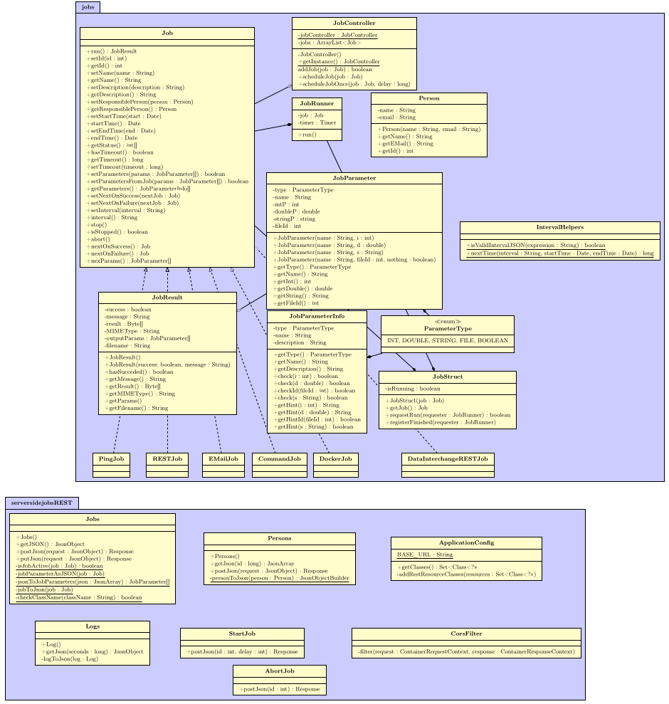

# Anhang

## Installationshinweise

### Installation des Backends

Für die Docker-Funktionalität muss der Docker-Demon laufen. Dessen Status kann
mit `docker info` abgefragt werden. Unter einem Systemd-System kann dieser mit
`sudo systemctl enable docker.service --now` aktiviert werden. Ggf. ist es
notwendig, der `docker`-Gruppe anzugehören.

Der Ping-Job verwendet zwei unterschiedliche Varianten um einen Server zu
pingen, eine dieser Varianten braucht ggf. `root`-Rechte. (Sollte die JVM nicht
ohnehin unter `root` laufen, sollte aus Sicherheitsgründen darauf verzichtet
werden; dann wird das `ping`-Kommando benutzt.)

### Installation des Frontends

1. Installation des Backend
2. aktuelle Version des Frontends aus dem Git-Repository herunterladen
   (<git@git01-ifm-min.ad.fh-bielefeld.de>:Lehre/webengineering2020/projekt3\_serversidejobs/frontend.git)
3. entpacken der heruntergeladen Datei in dem „docroot" Ordner des Payara
   Server(z.B. \...\\payara5\\glassfish\\domains\\domain1\\docroot\\)
4. umbenennen des entpackten Ordner zu „frontend"
5. testen der Installation durch aufrufen der Webseite im Browser (z.B.
   http://localhost:8080/frontend)

## Benutzerhandbuch

## Dashboard

### Nach Job suchen

Zwischen dem Button „NEUEN JOB ANLEGEN" und der Tabelle auf der Dashboard-Seite
befindet sich ein Suchfeld. Um nach einen Job zu suchen muss an dieser Stelle
der Name des Job eingegeben werden und durch klicken auf die Eingabetaste wird
nach dem Job gesucht. Wenn die Suche erfolgreich ist, wird einem der Job
darunter angezeigt sowie die ID des Jobs in dem Suchfeld.

### Job aktiv oder passiv setzen

Zuerst muss der gewünschte Job gefunden werden, dieses kann entweder mit dem
Suchfeld geschehen oder indem die Tabelle nach dem Job durchsucht wird. Wenn
der Job gefunden wurde, gibt es in der Tabellenspalte „AKTIV" einen Button. Auf
dem Button steht entweder „AKTIV:TRUE", wenn der Job aktiv ist oder
„AKTIV:FALSE", wenn der Job passiv ist. Durch klicken auf den Button ändert
sich der Zustand und es wird einem durch eine Nachricht angezeigt, ob es
erfolgreich ausgeführt wurde.

### Job bearbeiten

Zuerst muss der gewünschte Job gefunden werden, dieses kann entweder mit dem
Suchfeld geschehen oder indem die Tabelle nach dem Job durchsucht wird. Wenn
der Job gefunden wurde, kann durch klicken auf das Zahnrad der Job bearbeitet
werden.

### Log-Einträge von einem bestimmten Job anzeigen

Zuerst muss der gewünschte Job gefunden werden, dieses kann entweder mit dem
Suchfeld geschehen oder indem die Tabelle nach dem Job durchsucht wird. Wenn
der Job gefunden wurde, wird durch klicken auf den Button mit dem
Tabellensymbol, die Log-Seite mit den Log-Einträgen von dem ausgewählten Job
angezeigt.

### Job manuell starten

Zuerst muss der gewünschte Job gefunden werden, dieses kann entweder mit dem
Suchfeld geschehen oder indem die Tabelle nach dem Job durchsucht wird. Wenn
der Job gefunden wurde, wird durch klicken auf den Play-Button der Job manuell
gestartet. Bei Erfolgreichem ausführen des Jobs wird eine Nachricht angezeigt.

## Logs

### Log-Einträge nach Erfolg und Fehlschlag filtern

Um Log-Einträge zu filtern muss auf die Log-Seite gegangen werden. Auf der
Log-Seite befinden sich die Button „ALL", „SUCCESS" und „FAIL". Durch klicken
auf die Button werden einem jeweils die passenden Log-Einträge angezeigt.

## Jobs

Das Job-Formular stellt dem Anwender eine Möglichkeit bereit, neue Jobs zu
erstellen. Da jeder Job eine Menge gemeinsamer Parameter und jeweils eine Menge
eigener Parameter erwartet, teilt sich das Formular wiederrum in zwei Teile auf.

### Statischer Teil

Zum einen gibt es den *statischen* Teil, welcher die gemeinsamen Parameter
abfragt. Diese sind:

- **Name**: Der Name des zu erstellenden Jobs.
- **Description**: Eine Beschreibung für den Job.
- **Start Time**: *(Optional)* Job erst ab diesem Datum ausführen.
- **End Time**: *(Optional)* Job nur bis zu diesem Datum ausführen.
- **Interval**: Zeitabstände, in denen der Job wiederholt ausgeführt wird.
- **Job Class**: Die Art des Jobs (z. B. Ping-Job).

### Dynamischer Teil

Weiterhin benötigt jeder Job spezifische Parameter, welche erst nach Auswahl der
Jobklasse abgefragt werden. Dazu werden die verfügbaren Jobklassen beim Backend
abgefragt, sobald das Job-Formular aufgerufen wird.

## Klassendiagramm

Das komplette UML-Klassendiagramm fürs Backend:

